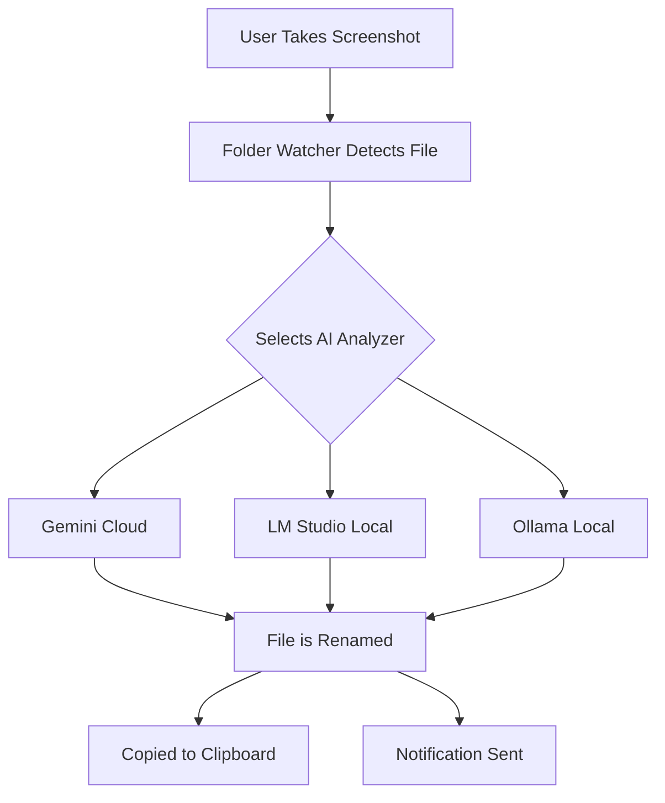

# The Screenshot Renamer: A Quiet Utility

For the curiously organized. This small utility observes a designated folder for new screenshots, considers their content, and bestows upon them a more thoughtful name.

It transforms `Screenshot 2024-06-23 at 12.30.00 PM.png` into `login_screen_with_error_message.png`. And then, with a subtle gesture, it places the newly named image onto your clipboard.

---

### Inviting the Utility to Your Workshop

To begin, a few preparations are in order. This utility relies on Node.js and, for cloud-based AI, an API key.

**1. Get an API Key (Optional)**

If you wish to use a cloud-based AI like Google Gemini, you must first acquire an API key. A visit to the [Google AI Studio](https://makersuite.google.com/app/apikey) will provide one. For local models like LM Studio or Ollama, this step is not required.

**2. Install the Utility**

Invite the utility's source code to your local machine and install its dependencies.

```bash
git clone https://github.com/LilSizzles/screenshot-renamer.git
cd screenshot-renamer
npm install
```

**3. Configure the Utility**

Next, you must introduce yourself to the utility. It offers several methods to accommodate any environment. Choose the one that best suits your needs.

*   **Method A: Interactive Setup (Recommended)**
    For a guided experience, use the `setup` command. It will ask for the necessary details.
    ```bash
    npm run setup
    ```

*   **Method B: Command-Line Setup**
    For automated or non-interactive environments, you may provide the configuration directly.
    ```bash
    npm run setup -- --api-key "YOUR_KEY" --folder "/path/to/your/screenshots"
    ```

*   **Method C: Quick Configuration**
    For the fastest setup, you can use the `configure.js` script with just your API key.
    ```bash
    node configure.js YOUR_API_KEY
    ```

**4. Test the Service**

With the setup complete, you can awaken the service for a test run.

```bash
npm run dev
```

Drop a screenshot into your designated folder. The utility will notice and act accordingly.

### The Inner Workings: How It Perceives

This utility employs an AI to discern the essence of your images. You are presented with three distinct approaches:

*   **Gemini**: A swift and capable intellect from Google, residing in the cloud. It requires an internet connection and a modest API key.
*   **LM Studio**: An intellect that resides upon your own machine, for those who prefer a local arrangement. It requires the LM Studio application.
*   **Ollama**: Another fine choice for local AI models. It is known for its light touch and ease of management.
*    *Ollama is significantly slower then LM Studio - exploration as to why is welcome. I use only LM Studio.*

These arrangements can be revisited at any time by invoking `npm run setup`.

### For a More Permanent Arrangement

Should you find this utility agreeable, you may invite it to reside permanently. This will establish it as a background service, awakening automatically upon your login.

*   **To Install**: `npm run install-service`
*   **To Uninstall**: `npm run uninstall-service`
*   **To Inquire**: `npm run status`

### The Finer Adjustments

For those who appreciate the precise calibration of their instruments, the utility's settings are housed within a simple ledger at `~/.screenshot-renamer-config.json`. This file may be edited directly, or one may prefer the more refined approach of the `config` command.

```bash
# To observe the current settings
npx screenshot-renamer config --show

# To adjust the observed folder
npx screenshot-renamer config --folder "/path/to/your/folder"
```

A complete inventory of settings, generally self-explanatory, can be found within the configuration file itself.


**Contributing**

The workshop door remains open. The core mechanisms reside within `src/index.js` and `src/folder-watcher.js`. The AI integrations are housed in `src/analyzers/`. Engaging `npm run dev` will illuminate the inner workings with necessary detail for development. An extra set of hands is always appreciated.


---

A quiet creation by [Max Milne](https://github.com/maxmilneaus).

### A Note on Performance

We conducted a few quiet observations on a MacBook Pro (M1 Max - 32gb - 24gpu) to discern the subtle differences between the two "brains." Your own results will, of course, exhibit their own unique character.

**☁️ Cloud Processing (Google Gemini)**
- **Model**: `gemini-2.5-flash-lite-preview-06-17`
- **Speed**: Approximately 4.5 seconds on average.
- **Quality**: Tends to offer highly descriptive and precise naming.
- **Cost**: The complimentary tier is quite accommodating, likely sufficient for many daily renames.

**🏠 Local Processing (LM Studio)**
- **Model**: `google/gemma-3-4b`
- **Speed**: Approximately 7 seconds on average.
- **Quality**: Provides a good, foundational naming.
- **Cost**: Free.

**🦙 Local Processing (Ollama)**
- **Model**: `google/gemma-3-4b`
- **Speed**: Approximately 27 seconds on average.
- **Quality**: Provides a good, thought slower, foundational naming.
- **Cost**: Free.

This utility is designed to be shared. Here are a few notes for those who wish to distribute it or contribute to its development.

**Distribution Options**

*   **GitHub Repoe, once the local arrangement is established.

**Built with help from Claude Code, Roo Code and Gemini 2.5 pro**